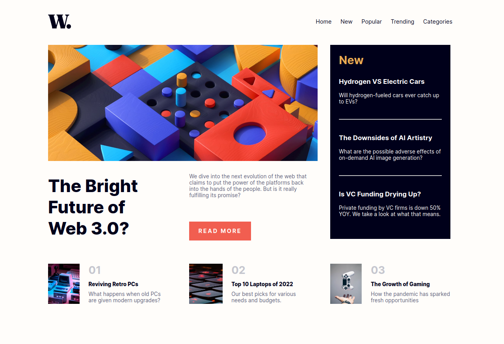

# Frontend Mentor - News homepage solution

This is a solution to the [News homepage challenge on Frontend Mentor](https://www.frontendmentor.io/challenges/news-homepage-H6SWTa1MFl). Frontend Mentor challenges help you improve your coding skills by building realistic projects.

## Table of contents

- [Overview](#overview)
  - [The challenge](#the-challenge)
  - [Screenshot](#screenshot)
  - [Links](#links)
- [My process](#my-process)
  - [Built with](#built-with)
  - [What I learned](#what-i-learned)
  - [Continued development](#continued-development)
- [Author](#author)

**Note: Delete this note and update the table of contents based on what sections you keep.**

## Overview

### The challenge

Users should be able to:

- View the optimal layout for the interface depending on their device's screen size
- See hover and focus states for all interactive elements on the page

### Screenshot

### Links

- Solution URL: [Add solution URL here](https://github.com/Asad-xnb/news_homepage)
- Live Site URL: [Add live site URL here](https://asad-xnb.github.io/news_homepage/)

## My process

### Built with

- Semantic HTML5 markup
- CSS custom properties
- Flexbox
- CSS Grid
- Desktop-first workflow

### What I learned

I learned to properly use CSS Grid.

### Continued development

I just Made it for the desktop size devices and for some reason I could not continue it for cell phone devices or smaller screens.
Also the JavaScript part where I have to make a hamburger button and make it working is somet

## Author

- Frontend Mentor - [@Asad-xnb](https://www.frontendmentor.io/profile/Asad-xnb)
- LinkedIn - [@Asad-zubair](https://www.linkedin.com/in/asad-xnb/)
